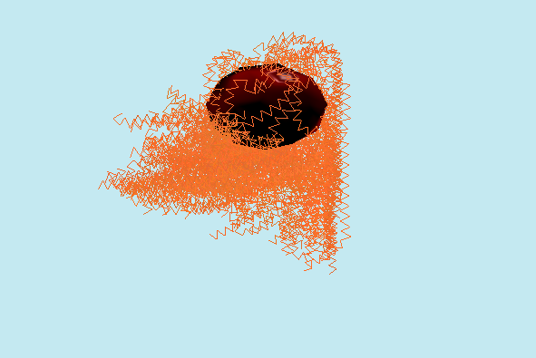

# Simulation of Curly Hair

This was my 5th semester Project Laboratory project at Budapest University of Technology and Economics. You can find the project report [here](docs/documentation.pdf), in the `docs` folder with all the details.



## Trying it out

### Dependencies

- [GLFW](https://www.glfw.org/)
- [GLEW](http://glew.sourceforge.net/)

For building:
- [CMake](https://cmake.org/) *(if you want to build the project following the instructions below)*
- and of course a compiler of your choice


After installing the dependencies, the easiest way to build the project is using the `CMakeLists.txt` file included.

### Installing the dependencies on Linux
On Linux-based systems that use the `apt` package manager, you can install these by running:

```shell
sudo apt-get update && sudo apt-get install -y \
    build-essential \
    cmake \
    libglfw3-dev \
    libglew-dev
```

### Building on Linux

Build the project with CMake. I recommend to create a `build` folder, and install there.

```shell
# create and cd into the build directory
mkdir build
cd build

# generate makefiles from the parent directory
cmake ..
# build the project
make

# run the project from the build directory
./brave2
```

